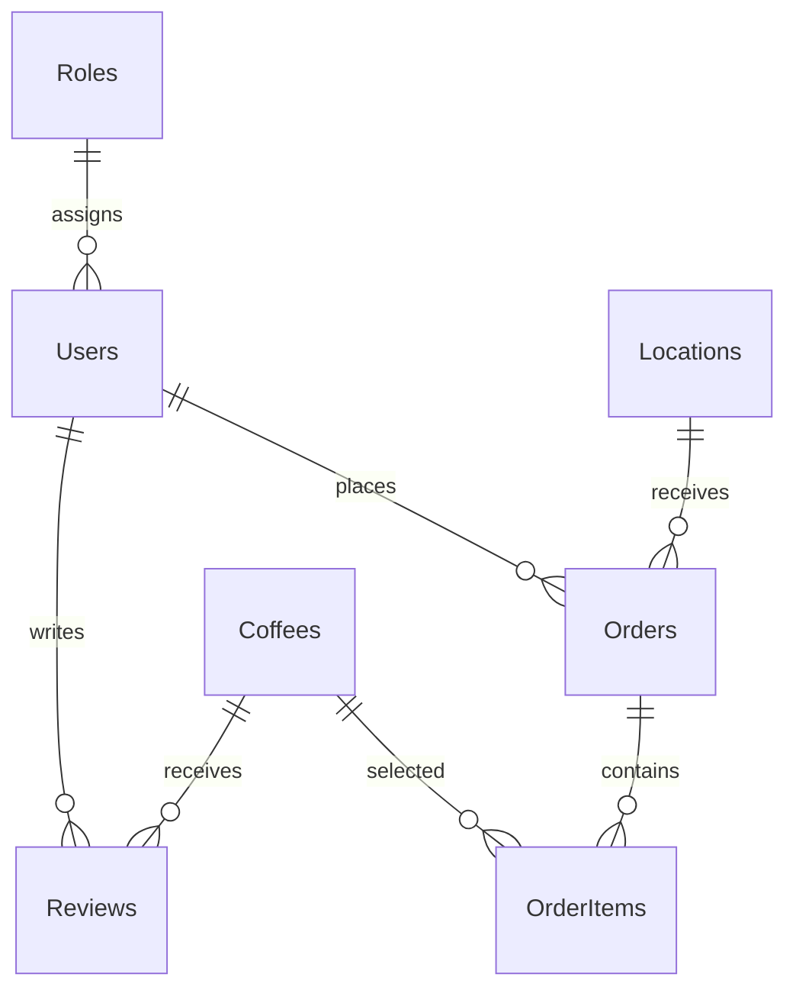

# BrewPoint Islamabad Database Diagram

```mermaid
erDiagram
  Roles ||--o{ Users : assigns
  Users ||--o{ Orders : places
  Locations ||--o{ Orders : receives
  Orders ||--o{ OrderItems : contains
  Coffees ||--o{ OrderItems : selected
  Users ||--o{ Reviews : writes
  Coffees ||--o{ Reviews : receives
```

Tables: `Users`, `Roles`, `Coffees`, `Locations`, `Orders`, `OrderItems`, `Reviews`.
